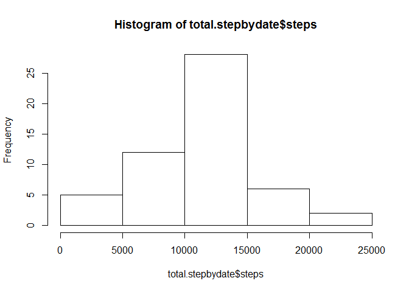
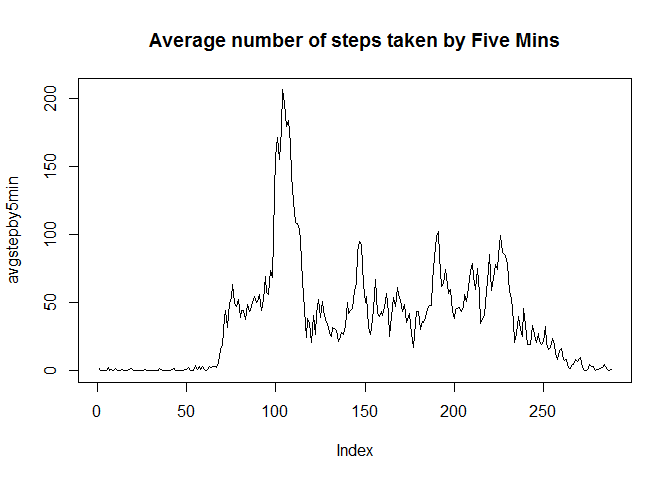
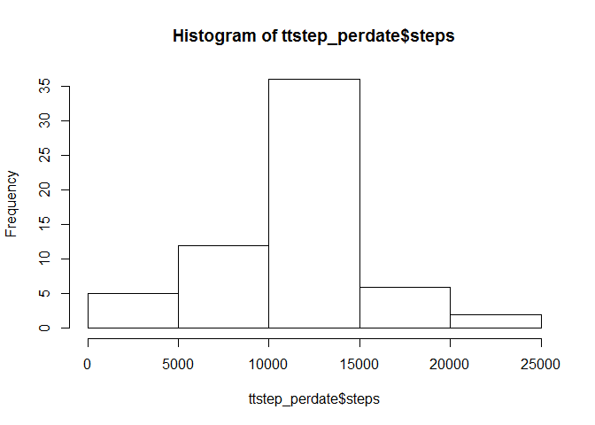
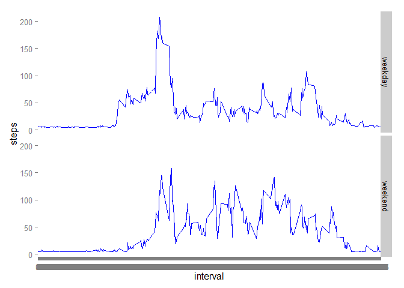

# Reproducible Research: Peer Assessment 1


##loading and preprocessing the data

```r
setwd("C:/Users/wei/Desktop/R/CourseRa Repro Research")
activity<-read.csv("./repdata-data-activity/activity.csv",header=T)
activity<-activity[,1:3]
```
##What is mean total number of steps taken per day?
###  histogram of the total number of steps taken each day

```r
total.stepbydate<-aggregate( steps~date, activity, sum,na.rm=T )
hist(total.stepbydate$steps)
```

 
###   mean and median total number of steps taken per day

```r
mean(total.stepbydate$steps,na.rm=T )
```

```
## [1] 10766.19
```

```r
median(total.stepbydate$steps, na.rm=T )
```

```
## [1] 10765
```

##What is the average daily activity pattern?
### a time series plot (i.e. type = "l") of the 5-minute interval (x-axis) and the average number of steps taken, averaged across all days (y-axis)


```r
avgstepby5min<- tapply(activity$steps, activity$interval, mean, na.rm = TRUE)
plot(avgstepby5min,type="l", main = "Average number of steps taken by Five Mins" )
```

 

###Which 5-minute interval, on average across all the days in the dataset, contains the maximum number of steps?

```r
rownum<-which.max(avgstepby5min)
avgstepby5min[rownum]
```

```
##      835 
## 206.1698
```
##Imputing missing values
###Calculate and report the total number of missing values in the dataset (i.e. the total number of rows with NAs)

```r
stepNA <- sum(is.na(activity))
stepNA
```

```
## [1] 2304
```
###Imputing the missings using the mean step of the day

```r
meanstep<-aggregate(steps~date, activity, mean, na.rm=T)
avgstep <-mean(activity$steps,  na.rm=T)
fillNA <- numeric()
for (i in 1:nrow(activity)) {
    obs <- activity[i, ]
    if (is.na(obs$steps)) {
    
        if (dim(subset(meanstep, date == obs$date))[1]==0 ){
        steps<-avgstep
        
        }else{
        steps <- subset(meanstep, date == obs$date)$steps
        }
    } else {
        steps <- obs$steps
    }
    fillNA <- c(fillNA, steps)
}
```
##Create a new dataset that is equal to the original dataset but with the missing data filled in.

```r
new_activity <- activity
new_activity$steps <- fillNA
```

##Make a histogram of the total number of steps taken each day and Calculate and report the mean and median total number of steps taken per day.

```r
ttstep_perdate<-aggregate( steps~date,new_activity, sum)
hist(ttstep_perdate$steps)
```

 
###report the mean and median total number of steps taken per day.

```r
meanttstep_afterimputation<-mean(ttstep_perdate$steps)
meanttstep_afterimputation
```

```
## [1] 10766.19
```

```r
medianttstep_afterimputation<-median(ttstep_perdate$steps)
medianttstep_afterimputation
```

```
## [1] 10766.19
```

```r
meanttstep_b4imputation<-mean(total.stepbydate$steps)
meanttstep_b4imputation
```

```
## [1] 10766.19
```

```r
medianttstep_b4imputation<-median(total.stepbydate$steps)
medianttstep_b4imputation
```

```
## [1] 10765
```
###**Comments: Mean and Median did not change much before and after imputation. The impact of the imputation will mostly be related to the variance of the total steps. After imputation, the variance decreased. 

##Weekday and weekend comparison
###Are there differences in activity patterns between weekdays and weekends?

```r
new_activity$weekday<-weekdays(as.Date(new_activity$date))
new_activity$weekend<-ifelse(new_activity$weekday %in% c("Saturday","Sunday"),"weekend","weekday")
new_activity$weekend <- factor(new_activity$weekend)

stepsByDay <- aggregate(steps ~ interval + weekend, data = new_activity, mean)
names(stepsByDay) <- c("interval", "weekend", "steps")
```
###final plots

```r
library(ggplot2)

    ggplot(stepsByDay, aes(x=interval, y=steps, color=weekend)) +
    geom_line(colour="blue") +
    facet_grid(weekend ~ .) +
    scale_x_discrete(labels=abbreviate)
```

 

```r
library(knitr)
```

```
## Warning: package 'knitr' was built under R version 3.1.2
```

```r
knit2html(input = "C:/Users/wei/Desktop/git/RepData_PeerAssessment1/PA1_template.Rmd")
```

```
## 
## 
## processing file: C:/Users/wei/Desktop/git/RepData_PeerAssessment1/PA1_template.Rmd
```

```
## 
  |                                                                       
  |                                                                 |   0%
  |                                                                       
  |.....                                                            |   8%
##   ordinary text without R code
## 
## 
  |                                                                       
  |..........                                                       |  15%
## label: unnamed-chunk-14
## 
  |                                                                       
  |...............                                                  |  23%
##   ordinary text without R code
## 
## 
  |                                                                       
  |....................                                             |  31%
## label: unnamed-chunk-15 (with options) 
## List of 1
##  $ echo: logi TRUE
```

```
## 
  |                                                                       
  |.........................                                        |  38%
##   ordinary text without R code
## 
## 
  |                                                                       
  |..............................                                   |  46%
## label: unnamed-chunk-16
## 
  |                                                                       
  |...................................                              |  54%
##   ordinary text without R code
## 
## 
  |                                                                       
  |........................................                         |  62%
## label: unnamed-chunk-17 (with options) 
## List of 1
##  $ echo: logi TRUE
```

```
## 
  |                                                                       
  |.............................................                    |  69%
##   ordinary text without R code
## 
## 
  |                                                                       
  |..................................................               |  77%
## label: unnamed-chunk-18
## 
  |                                                                       
  |.......................................................          |  85%
##   ordinary text without R code
## 
## 
  |                                                                       
  |............................................................     |  92%
## label: unnamed-chunk-19
## 
  |                                                                       
  |.................................................................| 100%
##   ordinary text without R code
```

```
## output file: PA1_template.md
```
